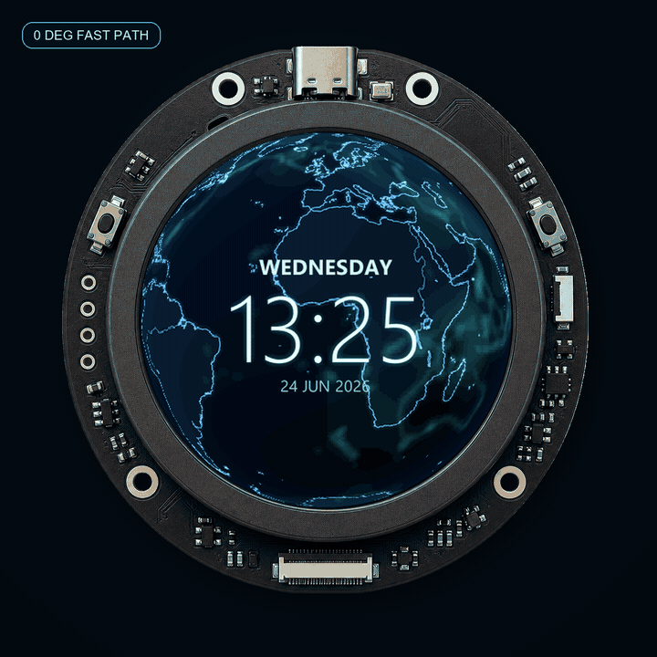
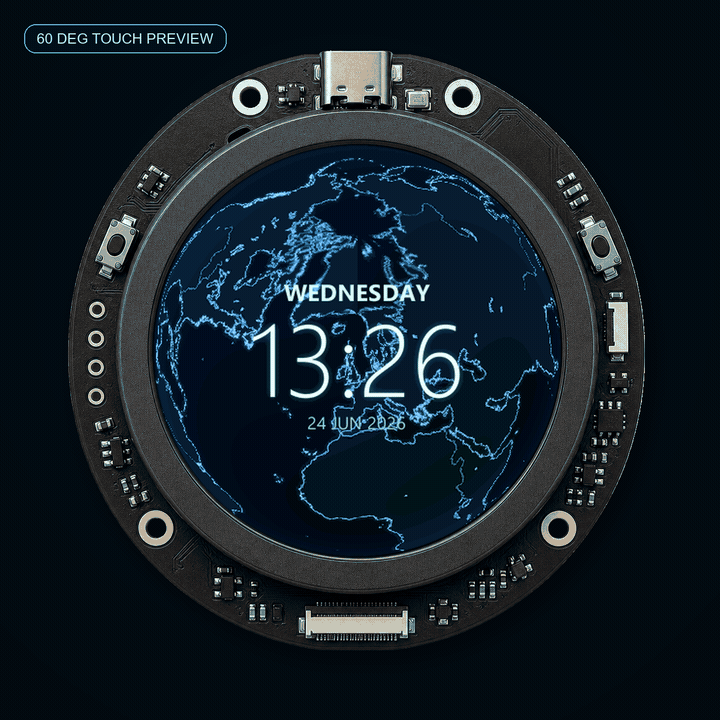
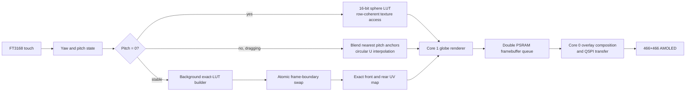

# ESP32-S3 real-time rotating globe

A real-time transparent Earth renderer and clock for the original
[Waveshare ESP32-S3-Touch-AMOLED-1.43][waveshare-wiki] with its round
466×466 QSPI AMOLED.

The firmware renders sharp cyan coastlines, a translucent rear hemisphere,
touch-controlled yaw and pitch, progressive exact projection refinement, and
digital/analog clock overlays. The normal frame loop uses integer math only.

## Demo

The animations below contain framebuffer frames captured directly from the
ESP32. The surrounding board is a
[virtual presentation mockup](docs/media/README.md).

<table>
  <tr>
    <td align="center">
      <a href="docs/media/demo-zero-pitch-device.mp4">
        
      </a>
      <br>
      <strong>0° fast path — one complete rotation</strong>
      <br>
      <a href="docs/media/demo-zero-pitch-device.mp4">Play MP4</a> ·
      <a href="docs/media/globe-zero-pitch.mp4">Raw framebuffer MP4</a>
    </td>
    <td align="center">
      <a href="docs/media/demo-pitch-refinement-device.mp4">
        
      </a>
      <br>
      <strong>60° pitch — touch preview → exact LUT</strong>
      <br>
      <a href="docs/media/demo-pitch-refinement-device.mp4">Play MP4</a> ·
      <a href="docs/media/globe-pitch-60-progressive.mp4">Raw framebuffer MP4</a>
    </td>
  </tr>
</table>

In the second video, the first 16 frames use the immediate touch-preview
projection. The exact dense LUT is released at frame 17 without resetting yaw.

## Features

- Real-time rotating 423-pixel globe on a 466×466 AMOLED.
- Transparent rear hemisphere built from blurred coastlines, lakes, rivers,
  and geographic fog.
- Horizontal drag controls longitude; vertical drag controls pitch from −80°
  to +80°.
- Touch pause, inertia, double-tap reset, and long-press display-mode cycling.
- Digital, analog, hybrid, and globe-only clock modes.
- PCF85063 RTC startup time plus background Wi-Fi/NTP synchronization.
- Europe/Brussels CET/CEST conversion while the RTC remains in UTC.
- Quiet release build with serial and screenshot code compiled out.
- Diagnostic framebuffer screenshots, deterministic movies, CRC validation,
  render profiling, and PSRAM reporting.

## Rendering architecture



### Zero-pitch fast path

At startup, every visible sphere pixel is projected once. A compact 16-bit LUT
stores:

- base longitude `U`;
- surface shade;
- subpixel rim coverage.

Latitude `V` is shared by each screen scanline. Per frame, yaw is only an
integer texture offset:

```cpp
frontU = (baseU + rotationTexels) & 1023;
```

This keeps map access row-coherent and sustains approximately 30 FPS.

### Progressive XY pitch

Arbitrary pitch cannot safely interpolate raw equirectangular coordinates:
longitude wraps at the antimeridian and becomes singular at a visible pole.
The renderer therefore separates interaction latency from final accuracy:

1. Dense front-coordinate anchors are precomputed at −80°, −55°, −25°, 0°,
   +25°, +55°, and +80°.
2. During touch, the two nearest anchors are blended immediately. Longitude
   uses shortest-path circular interpolation; latitude remains linear.
3. After 150 ms of pitch stability, a low-priority task builds an exact
   five-byte-per-pixel map containing independent front and rear `U/V`.
4. The completed map is swapped atomically at a frame boundary. Yaw is
   unchanged, and the rear hemisphere fades in over 300 ms.

Projection math (`asin`, `atan2`, sphere rotation) runs only while building a
LUT, never in the normal frame loop.

### Texture and memory layout

- Front geography: 1024×512, packed 4-bit intensity.
- Rear geography: 1024×512, packed 4-bit intensity for tilted rendering.
- Tilted textures: 16×4 texel tiles, exactly 32 bytes per tile.
- Framebuffers and pitch maps: ESP32-S3 PSRAM.
- Hot render loops: `-O3`, eight-pixel unrolling, internal executable RAM.
- Output: pre-swapped RGB565 with a direct 32 KB color table.

Tiling preserves full-resolution pixels while improving 2D cache locality.
At exact 60° it reduced globe rendering from 114.33 ms to 76.92 ms.
[Full benchmark history](docs/experiments.md).

### Dual-core pipeline

Core 1 renders the next 423×423 moving region while core 0 composites the
fixed overlay and transfers the previous buffer. The static exterior halo is
sent once at startup.

```text
Core 1: render globe N+1 ───────────────┐
                                       ├─ double-buffer queue
Core 0: overlay + QSPI transfer N ──────┘
```

## Source layout

`main.cpp` intentionally remains the single translation unit so IRAM placement,
inlining, and the established hot-path code generation do not change. Its
implementation is split by responsibility:

| File | Responsibility |
|---|---|
| [`src/main.cpp`](src/main.cpp) | Build configuration, shared state, allocation, `setup()`, and `loop()` |
| [`src/internal/board_services.inl`](src/internal/board_services.inl) | I2C, RTC/NTP, touch, and panel-controller detection |
| [`src/internal/projection_pipeline.inl`](src/internal/projection_pipeline.inl) | Sphere LUTs, pitch anchors, exact-map builder, and tiled textures |
| [`src/internal/render_pipeline.inl`](src/internal/render_pipeline.inl) | Zero-pitch, preview, exact renderers, and display transfer task |
| [`src/internal/overlay.inl`](src/internal/overlay.inl) | Four-bit alpha fonts, clock modes, glow, and overlay composition |
| [`src/internal/diagnostics.inl`](src/internal/diagnostics.inl) | Screenshot protocol, profiling counters, and debug commands |
| [`tools/generate_world_map.py`](tools/generate_world_map.py) | Natural Earth rasterization and texture packing |
| [`tools/generate_ui_fonts.py`](tools/generate_ui_fonts.py) | Offline alpha-glyph generation |

This is a low-risk structural split rather than a class-heavy rewrite: the
renderer still compiles as one optimized unit.

## Hardware

Target: original [ESP32-S3-Touch-AMOLED-1.43][waveshare-product], not the newer
`1.43C` pinout.

| Resource | Configuration |
|---|---|
| MCU | ESP32-S3, dual core, 240 MHz |
| Display | 1.43-inch round AMOLED, 466×466 |
| Display bus | QSPI, requested 80 MHz |
| Flash / PSRAM | 16 MB / 8 MB |
| Touch | FT3168 over shared I2C |
| RTC | PCF85063 |
| Panel controllers | SH8601 or CO5300-compatible, detected at startup |

Display pins:

| Signal | GPIO |
|---|---:|
| QSPI CS | 9 |
| QSPI CLK | 10 |
| QSPI D0…D3 | 11, 12, 13, 14 |
| AMOLED reset | 21 |
| AMOLED enable | 42 |
| I2C SDA / SCL | 47 / 48 |

## Build and upload

Requirements:

- [PlatformIO][platformio-esp32]
- USB-connected Waveshare board
- Python 3 for map/font/capture tools
- FFmpeg only for movie generation

```powershell
$env:PYTHONUTF8 = "1"
pio run
pio run -t upload --upload-port COM21
```

The default `waveshare_amoled_143` environment is the release build. It
compiles out periodic serial output, screenshot handling, and the FPS overlay.

For quiet profiling and framebuffer capture:

```powershell
pio run -e waveshare_amoled_143_screenshot -t upload --upload-port COM21
python tools/profile_performance.py --port COM21 --pitch 60 --phase exact
python tools/capture_screenshot.py --port COM21 --output globe.png
```

### Wi-Fi credentials

Credentials belong only in ignored `src/wifi_secrets.h`:

```powershell
Copy-Item src/wifi_secrets.example.h src/wifi_secrets.h
```

Edit the copied file. Do not commit it.

## Touch controls

| Gesture | Action |
|---|---|
| Touch and hold | Pause automatic rotation |
| Horizontal drag | Rotate longitude |
| Vertical drag | Change pitch |
| Release | Continue with inertia |
| Double tap | Reset yaw and pitch |
| Stationary 700 ms press | Cycle digital, analog, hybrid, globe-only |

## Rebuilding generated assets

Map textures use public-domain
[Natural Earth 1:50m physical vectors][natural-earth]. They are rasterized at
4× resolution and downsampled with LANCZOS before four-bit packing.

```powershell
python tools/generate_world_map.py --width 1024 --height 512 --supersample 4 `
  --output src/world_texture.h --front-output src/world_front_1024.h `
  --preview world-texture-preview.png

python tools/generate_ui_fonts.py --supersample 4
```

## Theory and references

- [Waveshare board wiki][waveshare-wiki] — schematics, dimensions, pinout, RTC,
  touch, and vendor demos.
- [Equidistant cylindrical / equirectangular projection][equirectangular] —
  the source texture coordinate system and its polar distortion.
- [Map Projections: A Working Manual][usgs-projections] — projection theory
  and spherical coordinate formulas.
- [ESP32-S3 external RAM guide][esp-psram] — PSRAM allocation and cache
  behavior that motivated 32-byte texture tiling.
- [Natural Earth 1:50m physical vectors][natural-earth] — coastlines, lakes,
  and rivers.
- [Arduino_GFX][arduino-gfx] — display-controller and QSPI transport library.

## Measurements and diagnostics

Detailed optimization history, texture-layout comparisons, build-latency
measurements, serial commands, and reproducible capture commands are in
[`docs/experiments.md`](docs/experiments.md).

[waveshare-wiki]: https://www.waveshare.com/wiki/ESP32-S3-Touch-AMOLED-1.43
[waveshare-product]: https://www.waveshare.com/esp32-s3-touch-amoled-1.43.htm
[platformio-esp32]: https://docs.platformio.org/en/latest/platforms/espressif32.html
[equirectangular]: https://doc.esri.com/en/arcgis-pro/latest/help/mapping/properties/equidistant-cylindrical.html
[usgs-projections]: https://pubs.usgs.gov/publication/pp1395
[esp-psram]: https://docs.espressif.com/projects/esp-idf/en/stable/esp32s3/api-guides/external-ram.html
[natural-earth]: https://www.naturalearthdata.com/downloads/50m-physical-vectors/
[arduino-gfx]: https://github.com/moononournation/Arduino_GFX

Code is generated with Codex 5.5